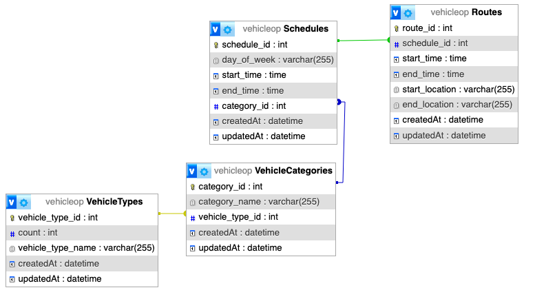

# Innovent Integrated Solutions

## Scope

1. The scope of the test is to create REST apis (Create and Get) for vehicle operations.
2. The tasks are divided into as follows
    - Store the count of vehicles based on their vehicle type (SUV,Sedan etc).
    - The vehicle type can be further divided into vehicle categories ie STANDARD, STANDBY and WHEELCHAIR.
3. Each vehicle category can have its own schedules of operation (Start time and end time) for each day of the week.
    - Eg- Monday - 8am - 6pm
4. Each schedule can have its own route along with timings and coordinates for the same.
    - Eg- 11 am to 2 pm (Abu Dhabi to Dubai)

## Implementation

The following guidelines followed in the project: 
✅  TypeScript is used for development to enable strong typing and enhance code quality. 
✅ Sequelize ORM along with sequelize-typescript is used for interacting with the database. 
✅ Zod is used for schema validation to ensure that incoming data conforms to the expected structure and format. 
✅ MySQL for Database. 
✅ Object-oriented programming (OOP) practices such as encapsulation, abstraction, and inheritance are used to make the code more modular and maintainable. 
✅ Critical functions are documented to provide clarity and ease of use for other developers who might work on the codebase.  
✅ Best coding practices are followed to ensure the code is readable, maintainable, and efficient. 
✅ Jest is used for testing to ensure that the code is correct and to prevent regressions. 
✅ Comments are provided for critical functions 

### DB Design

### Project Setup
1. Run MySQL from local or setup using docker provided under docker-workspace provided in the project
2. npm i and npm start
3. npm run test to run tests

### Routes
The project exposed 3 APIs:
1. create -- http://localhost:3000/routes -- POST
2. getAll -- http://localhost:3000/routes -- GET
3. getById -- http://localhost:3000/routes/20 -- GET

### Steps to install mysql through docker
1. Go to docker-workspace
2. run docker compose up
3. run docker inspect docker-workspace_db_1
4. capture IPAddress like "IPAddress": "172.20.0.2",
5. go to http://localhost:8080/
6. put the ip address
7. username root
8. password example_pass
9. create database name as `vehicleop` with utf_unicode_8
10. update the db name at src/db/config.ts for any other DB Name
